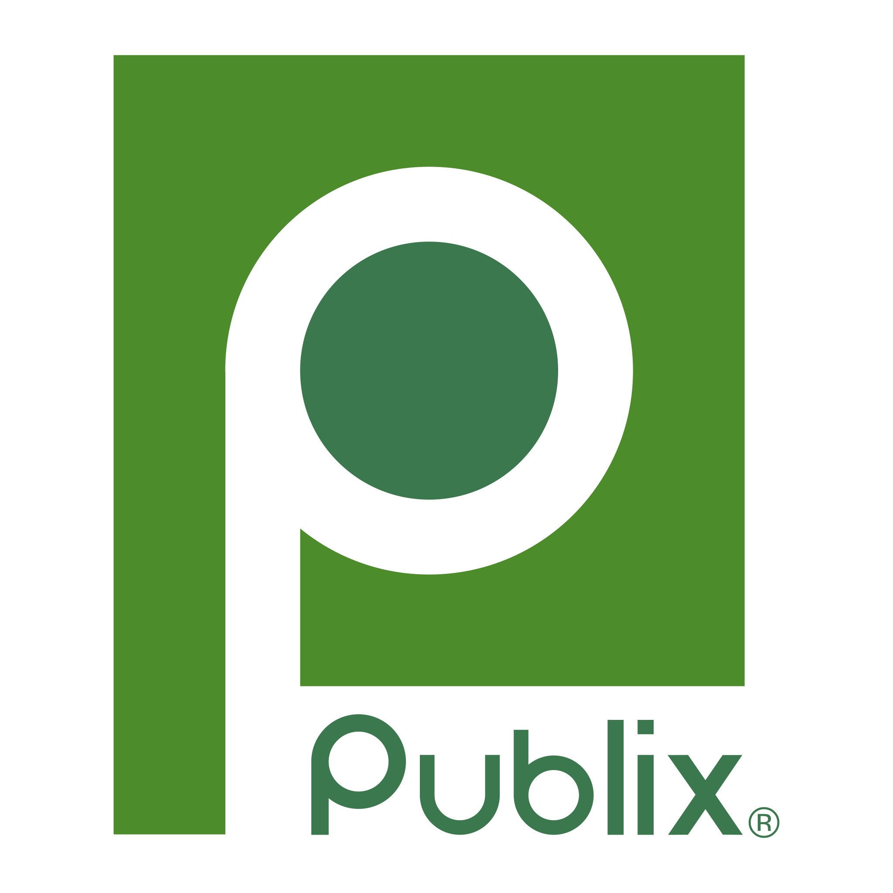

<p align="center">
  
  &nbsp;&nbsp;×&nbsp;&nbsp;
  
</p>

<h1 align="center">Agentic End-to-End Developer Experience</h1>
<p align="center">A hands-on workshop: build a full data + AI stack with Genie Code - describe, generate, review, deploy.</p>

---

Take an idea to a governed, deployed result in one day. You build a real-time pipeline, a governed medallion, metric views, a Genie agent, and an app - and see how much of it an agent can drive.

## What's here

- **`labs/`** - six hand-out notebooks (run in order).
- **`slides/`** - the Part 1 (data engineering) facilitator deck.
- **`app/`** - Store Pulse, the reference "art of the possible" app (FastAPI + React: lakehouse reads, Lakebase writes, Genie).
- **`flagship-storesight-iq/`** - the finished StoreSight IQ app (the real-time labor-forecasting opener) that `FLAGSHIP_PROMPTS.md` rebuilds layer by layer. Reference source; re-point its `app.yaml` IDs to your own workspace.
- **`PROMPTS.md`** - the Genie Code prompt playbook. **`HANDOFF.md`** - the participant hand-out.
- **`SETUP_SERVICE_PRINCIPAL.md`** - one-time admin setup for the Zerobus publisher's service principal (participants only need their workspace login).
- **`FLAGSHIP_PROMPTS.md`** - the "art of the possible" build: StoreSight IQ (real-time labor forecasting) decomposed into 7 Genie Code prompts, one per layer (UC → Zerobus → SDP → 4 ML models → Genie → Lakebase → App Builder).

Placeholders like `<workspace-id>`, `<warehouse-id>`, `<genie-space-id>` are yours to fill in. No real infra IDs in this repo.

## Clone this repo (two places)

Clone it **twice** - once into the workspace, once onto your laptop:

1. **Into your Databricks workspace, as a Git folder.**
   Workspace → **Repos / Git folders** → **Add Git folder** → paste this repo's URL.
   This is where you run the notebooks and where Genie Code writes code. You build live here.
2. **Onto your laptop** (`git clone ...`).
   You only need this for the one thing that runs locally: the Zerobus publisher
   (`src/zerobus/publisher.py`). Set up an isolated environment with [uv](https://docs.astral.sh/uv/):
   ```bash
   uv venv --python 3.11
   source .venv/bin/activate
   uv pip install -r requirements.txt
   ```
   Then set the four env vars from the publisher header (`ZEROBUS_SERVER_ENDPOINT`,
   `DATABRICKS_WORKSPACE_URL`, `DATABRICKS_CLIENT_ID`, `DATABRICKS_CLIENT_SECRET`) and run
   `python src/zerobus/publisher.py`.

Genie Code writes *into* the workspace folder - it doesn't replace it. The notebooks are your
reference / answer key: if a live generation drifts, open the matching notebook and catch up.

## The notebooks

1. `notebook_1_setup` - create your own catalog/schemas/tables + mock data (run first).
2. `notebook_2_kafka_producer` - local Kafka producer (optional; laptop).
3. `notebook_3_zerobus_genie_code` - real-time POSA + TPR ingest, built with Genie Code.
4. `notebook_4_sdp_medallion` - bronze (raw Kafka envelopes) -> silver (exploded + decoded) -> gold (daily aggregates) with Spark Declarative Pipelines. Each participant builds the same pipeline structure in their own catalog.
5. `notebook_5_genie_spaces` - metric views + a Genie space/agent (created via the API).
6. `notebook_6_build_ship_app` - build + ship a Databricks App, two ways: **Genie App Builder** (no-code, describe it in the UI and deploy a Serverless Micro App) or the **FastAPI+React reference** in `app/`. See `PROMPTS.md` → Notebook 6.

## Prerequisites

- A Databricks workspace with **Genie Code enabled** and a **serverless SQL warehouse**.
- Permission to **create schemas + tables** in a catalog.
- The Databricks CLI, authenticated.
- For the Genie App Builder path: the **Governed agentic app-building** preview enabled + an **App Space** (with the warehouse, gold table, and Genie space as resources) you have **CAN CREATE APP** on. Optional - the `app/` reference is the fallback.

## The loop, every time

Describe → Generate → **Review** (read the plan, open a PR, keep a human in the loop) → Deploy.

## Take-home - Build Studio (spec-driven)

Keep building after the workshop with **Build Studio**: an agentic "vibe-to-value" app where you describe a problem, it writes a spec, and it builds the full stack from that spec (Zerobus → SDP → Genie → Lakebase → Databricks App) - the spec-driven way.

Repo: **https://github.com/KabeerThockchom/build-studio** (`master`). Clone it, point it at your workspace, and deploy as a Databricks App.
