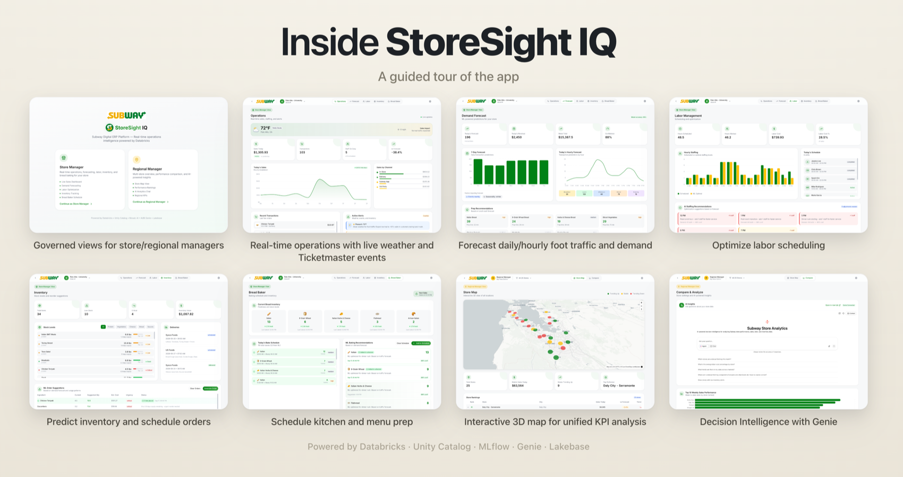

# 🍽️ StoreSight IQ — QSR Solution Accelerator

**Real-time store-operations intelligence for Quick-Service Restaurants, on Databricks.**
Spin up a fully branded, customer-specific demo — live operations, ML forecasting,
labor, inventory, production-prep scheduling, and natural-language analytics — in an
afternoon instead of a week.

> Proven across multiple QSR customer deployments, then generalized into this
> reusable accelerator: everything customer-specific is driven by two config
> files, applied by a generator, and deployed by a Databricks Asset Bundle.

---

## App Tour

<p align="center">
  <br>
  <em>StoreSight IQ is a unified end-to-end operations intelligence App that combines ML/AI-based analytics across demand forecasting, labor scheduling, inventory optimization, and kitchen/menu prep. Built on Lakebase, Unity Catalog, Genie, and MLflow leveraging custom ML models trained and deployed on Databricks.</em>
</p>

---

## What you get

Seven UI surfaces across two personas:

**Store Manager** — Operations (live sales/staffing/alerts) · Forecast (ML demand) ·
Labor (ML staffing) · Inventory (ML reorder) · **Prep Scheduler** (the configurable
"production-prep" vertical — bake/fry/proof/press, per customer).

**Regional Manager** — Store Map (3D fleet) · Compare (rankings + **embedded Genie**).

## Enablement (pitch, script, video)

Everything you need to pitch and run this demo lives in **[`enablement/`](enablement/)**:

- **[Pitch deck](enablement/storesight-iq-pitch-deck.html)** — 2-slide framing deck (problem + the three capabilities).
- **[Demo script](enablement/demo-script.md)** — a tell → show → tell walkthrough (framework + cues).
- **[Demo video](https://drive.google.com/file/d/1xrzniM71WO5pqKISektULx_hUsZV5Q0U/view?usp=sharing)** — end-to-end recording for SA prep (an earlier customer-specific build — reference only, don't show customers directly; see [`enablement/README.md`](enablement/README.md)).

## Architecture

```
┌──────────────────────────────────────────────────────────────┐
│                     Databricks App (FastAPI)                   │
│   React + Vite + Tailwind (frontend/dist)  ← served by FastAPI │
│                     FastAPI (main.py)                          │
│     /api/stores /operations /forecast /labor                   │
│     /inventory  /prep       /genie     /state                  │
└──────┬──────────────┬───────────────┬───────────────┬─────────┘
       │              │               │               │
  SQL Warehouse  Model Serving    Genie space     Lakebase
  (UC tables)    (4 endpoints)    (embed iframe)  (app state)
       │
  Unity Catalog: <catalog>.<schema>
```

- **Frontend** (React/Vite/Tailwind) builds to `frontend/dist/` and is served by FastAPI.
- **Backend** queries UC via the SQL Warehouse, calls 4 Model Serving endpoints, and
  persists user actions to Lakebase (Postgres). Every endpoint falls back to
  deterministic synthetic data (`services/demo_data.py`) so the app runs even before
  the backing services are wired.
- **Genie** is embedded on the Compare page via an iframe (workspace external
  embedding required), mounted once at the app root so the session persists.
- **Single source of truth:** the product taxonomy lives in `config/domain.json`
  (generated from `accelerator/domain.yaml`) and is read by **both** the backend and
  the training notebooks — so the ML feature contract can't drift.

---

## Getting Started Adapting to Your Customer

**▶️ Get started** — clone the repo to your machine:

```bash
git clone https://github.com/databricks-field-eng/rct-qsr-storesight-iq.git
cd rct-qsr-storesight-iq
```

Then open it in your coding agent (Claude Code / Cursor / etc.) and paste the prompt
below — insert your customer's name — to kick off the guided interview:

```text
You are an expert Databricks developer. Thoroughly read the rct-qsr-storesight-iq repo and guide me through setting up and configuring the solution for my customer, <CUSTOMER NAME>.
```

Fill in `<CUSTOMER NAME>`. The skill drives everything else — interview →
confirmation gate → generate → deploy → run → wire → verify.

### Option A — Guided (recommended)
Run the bundled skill (`accelerator/skill/SKILL.md`): it interviews you for the
inputs, fills both config files, runs the generator + residue audit, builds, and
walks you through the deploy + wiring.

> ⏱️ **Time to budget:** the interview takes **~5 min**. After that, the **entire
> automated pipeline — from configs set to a finished, deployed asset with a working
> app — runs ~30–40 min, mostly unattended**:
> `bundle deploy` (UC schema + app shell) → `bundle run storesight_setup` (synthetic
> data + the 4 materialized views + **training and deploying 4 real ML models** for
> demand / labor / inventory / prep + the Genie space + the streaming job) →
> `wire_app.py` (UC + Lakebase grants, attach the 4 serving endpoints / secret /
> Lakebase, set `GENIE_SPACE_ID`, warm endpoints, enable embedding, app deploy +
> `/api/health` poll). Kick it off and step away — it finishes with a live, branded app.

**First I ask: real company or fictitious?** (I infer from the name and confirm.)
This decides what *you* supply vs. what *I* source for you — for a **real** company
I web-search the logos, brand colors, and store locations, so you supply almost
nothing; for a **fictitious** one you provide (or I synthesize) them.

**What it asks — three quick rounds** (I narrate which step we're on throughout):
1. **Identity & brand** — customer name + a unique lowercase `short_code`. Special
   characters are stripped from every *derived* name (schema, resource prefix,
   app/bundle names, DAB target) so they never break SQL/DAB — e.g. "Fresh-Mart" →
   `freshmart`, "Mama's Hot Chicken" → `mamashotchicken`. Then brand colors, tagline,
   and **two logos** (a wordmark + a smaller mark):
   - **Real** → I **web-search and pull down the official logo myself** (PNG/SVG,
     transparent background — if it isn't transparent I remove the background,
     preserving quality) plus a smaller mark; if there's no obvious simpler mark I
     make a product-style favicon (a sub roll, a burger, a doughnut…) in your brand
     colors. I only ask you to paste one if a thorough search finds nothing. **Logos
     are gathered + confirmed during the interview** — a required gate, nothing left
     for later.
   - **Fictitious** → you give colors (or one and I derive dark/light); I keep a
     neutral, brand-colored placeholder (or draft a simple mark).
2. **Databricks target** *(always required)* — CLI profile, then **I ask which
   catalog to use** (I list them; it must already exist — I never assume one) and
   **confirm the schema** I'll create in it. Plus SQL warehouse id and
   `resource_prefix` (endpoint / Lakebase / app names default from it).
   - **Ticketmaster (optional):** for *real* local events I walk you to
     **https://developer.ticketmaster.com/explore/** → "Get Your API Key", and you
     paste the Consumer Key **during the interview** — I store it as a Databricks
     secret before deploy. No key = fresh synthetic events.
3. **Product taxonomy** — prep-ahead vertical, ingredients + categories, menu items,
   hours + dayparts, channels, the store fleet, Genie questions:
   - **Real** → I web-search your **real store locations** (offering regional
     groupings) AND your **actual, current menu / signature items / ingredients**,
     then use them to drive every page and the synthetic data so the whole app reads
     like the real brand; you confirm/tweak.
   - **Fictitious** → you give a **store count + metro** (I synthesize locations) and
     the menu/prep model.

**Then one confirmation gate — you greenlight once.** After the interview (and once
logos are gathered), I read back **every** decision in a single organized summary —
brand + `short_code` + branch, catalog/schema and all derived asset names, whether
the Ticketmaster key was gathered (and the secret scope/name it'll live under), and
the full domain/menu model — so you can change anything before I edit **any** config
or deploy. I infer the working branch off `main` here too (change it if you like);
all build + deploy work happens on that branch, so `main` stays the clean template.

**What YOU need to bring — everything else I source or default:**
- **Always required:** the Databricks target that must *already exist* — a CLI
  profile, a **catalog you pick** (I list them; the accelerator won't create one), a
  SQL warehouse id, and a project-based Lakebase `<resource_prefix>-oltp` — plus a
  unique `short_code`.
- **Real customers:** nothing extra — I fetch the logos (background-removed), colors,
  store locations, and the real menu myself.
- **Fictitious customers only:** brand colors (or one to derive from), a logo (or
  accept the placeholder), and a store count + metro.
- **Optional (any customer):** a free Ticketmaster Consumer Key from
  **https://developer.ticketmaster.com/explore/** for real local events — I collect
  it during the interview (synthetic events otherwise).

**You can override anything I auto-source or default** — brand colors + dark/light
variants, either logo, the store fleet, menu items, dayparts/hours, sales channels,
endpoint/Lakebase/app names, and data volume — just say so during the interview.

### Option B — By hand
```bash
# 0. Work on a customer branch off main (never build/deploy on main)
git checkout main && git pull origin main
git checkout -b <customer_name>   # lowercased, snake_case if multi-word (e.g. delta_subs)

# 1. Fill the two config files (copy the templates)
cp accelerator/customer_config.example.yaml accelerator/customer_config.yaml   # brand, naming, deploy target
cp accelerator/domain.example.yaml           accelerator/domain.yaml           # product taxonomy

# 2. Apply them across the repo (idempotent), then scan for residue
python accelerator/generate.py
python accelerator/audit.py     # gate: 0 FAIL / 0 HIGH before deploying

# 3. Build the frontend
cd frontend && npm install && npm run build && cd ..

# 4. Deploy everything (uses the CLI profile from customer_config.yaml)
databricks bundle validate -p <profile>
databricks bundle deploy   -p <profile>
databricks bundle run      storesight_setup -p <profile>   # notebooks 01→07

# 5. Wire the app (no UI): UC + Lakebase grants, attach endpoints/secret/Lakebase,
#    GENIE_SPACE_ID, warm endpoints, external embedding, app deploy + health poll
python accelerator/wire_app.py            # --dry-run to preview; see WORKSPACE_STEPS.md

# 6. Verify (wire_app.py already polls this at the end)
curl -s https://<app-url>/api/health   # expect "healthy"
```

> ⚠️ Never `databricks bundle deploy` after `wire_app.py` — it reconciles the app
> to the resources declared in `databricks.yml` and wipes what the script
> attached. Re-run `wire_app.py` if you must redeploy the bundle.

### The two config files
| File | Holds | Notes |
|---|---|---|
| `accelerator/customer_config.yaml` | Brand colors, names, logo paths, Databricks profile/host/catalog/schema/warehouse | Mostly lookups |
| `accelerator/domain.yaml` | Prep subtypes, ingredients + categories, stores (geocoded), hours/dayparts, channels, Genie questions | **Domain modeling** — a person confirms the customer's real menu/ops |

### What's automated vs. human
- 🤖 **Generator + DAB:** all naming, brand re-skin, copy, `domain.json`, notebook
  params, synthetic data + the 4 materialized views + ML training +
  serving-endpoint creation + Genie space + streaming, and the frontend build +
  `bundle deploy`.
- 🤖 **Wiring script** (`accelerator/wire_app.py`): the whole post-deploy wire-up
  that used to be manual — UC grants to the app SP, the Lakebase Postgres grant
  (`SET ROLE pg_database_owner; GRANT … CREATE ON SCHEMA public`), attaching the
  serving endpoints + secret + Lakebase to the app, `GENIE_SPACE_ID`, warming
  endpoints, external embedding, and app start/deploy + health check.
- 👤 **Human, once** (`accelerator/WORKSPACE_STEPS.md` §1): ensure the catalog +
  SQL warehouse + Lakebase instance + CLI profile exist, and **pick the catalog when
  the interview asks**. Logos are web-sourced during the interview (you only paste
  one if a search finds nothing), and the optional Ticketmaster key is gathered in
  the interview with the secret created for you before deploy. The only step that
  needs workspace-admin is the external-embedding toggle — if the caller isn't an
  admin, that one line is the manual fallback.

---

## Repo layout

```
accelerator/          # the accelerator kit
  customer_config.example.yaml   # brand + naming + deploy targets (manifest)
  domain.example.yaml            # product taxonomy (single source of truth)
  generate.py                    # applies the configs across the repo (idempotent)
  skill/SKILL.md                 # the guided-interview skill
  README.md · WORKSPACE_STEPS.md · BUILD_PLAN.md
  assets/                        # customer logo files go here
databricks.yml        # Databricks Asset Bundle (schema, setup + teardown jobs, app)
main.py · api/ · services/ · config/   # FastAPI backend (+ config/domain.py loader)
frontend/             # React/Vite/Tailwind (brand.ts colors, brand.config.ts identity)
notebooks/            # 01 data → 02–05 train+serve → 06 Genie → 07 streaming
setup/                # teardown.py + setup/teardown lifecycle (README.md)
enablement/           # pitch deck, demo script, demo video link
```

See **`accelerator/README.md`** for the full overview, **`WORKSPACE_STEPS.md`** for
the prerequisites + automated wiring (`wire_app.py`), and **`BUILD_PLAN.md`** for
how the accelerator is built.
